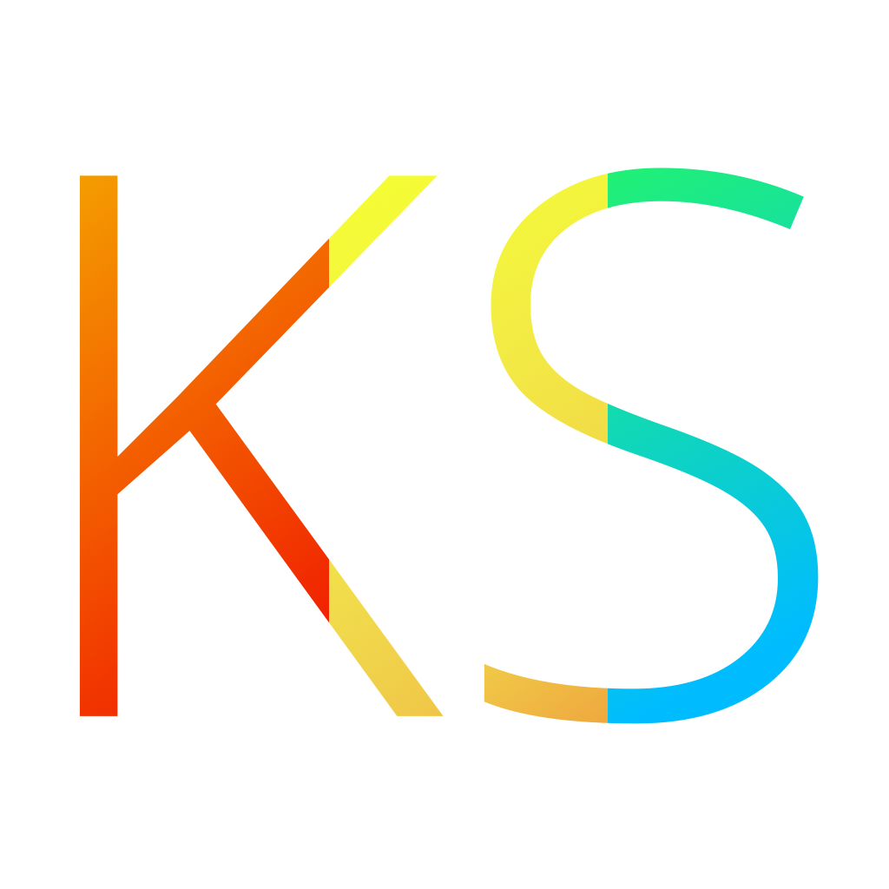

# 

# Kubi Server
Control your Kubi

This repository contains the source code for Kubi Server iOS app.

This app consists in the following main components:

 * Exposing a Kubi control API on local iOS device network.
 * Exposing video live streaming.

## Installation Requirements

- Xcode
- Cocoapods installed

## User Steps after installation

- Open the app (control API will automatically be deployed)
- Connect using Bluetooth to the Kubi using the 'Scan' button. You can check Kubi connectivity using control buttons
- Tap 'Stream camera' button to deploy streaming API
- Use control & streaming URLs added

The control server should be running even if the app is in background.

## Contributing

Everything works around one branch (`master`) to follow the [Github Flow](https://guides.github.com/introduction/flow/). 

Feel free to submit pull requests.
**Test your code** and existing (not yet tested) code if possible before pull requests.

## Pods used
 * [HaishinKit (formely lf)](https://github.com/shogo4405/lf.swift)
 * [GCDWebServer](https://github.com/swisspol/GCDWebServer)

## Authors
 * Victor Nouvellet

## License
 * KubiServer is released under a BSD License. See LICENSE file for details.

## Related project
* [Accessors](http://accessors.org)

## See also
 * [Presentation]()
 * [Kubi](https://www.revolverobotics.com/)
